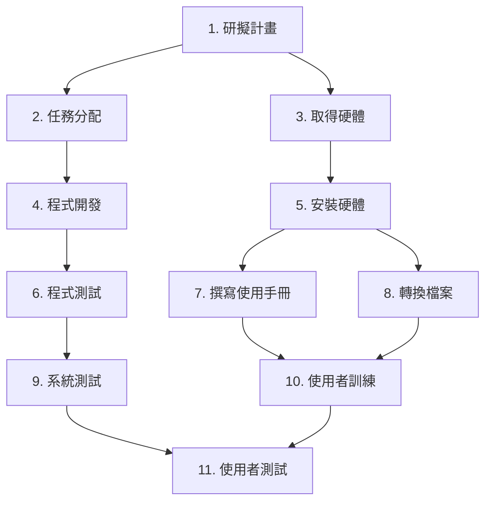

# HW2

## 工作分解結構清單11項任務
| 任務 | 說明         | 需時(天) | 前置任務 |
|------|--------------|----------|----------|
| 1    | 研擬計畫     | 1        | -        |
| 2    | 任務分配     | 4        | 1        |
| 3    | 取得硬體     | 17       | 1        |
| 4    | 程式開發     | 70       | 2        |
| 5    | 安裝硬體     | 10       | 3        |
| 6    | 程式測試     | 30       | 4        |
| 7    | 撰寫使用手冊 | 25       | 5        |
| 8    | 轉換檔案     | 20       | 5        |
| 9    | 系統測試     | 25       | 6        |
| 10   | 使用者訓練   | 20       | 7, 8     |
| 11   | 使用者測試   | 25       | 9, 10    |

---
## (1) PERT/CPM 圖

---
## (2) 甘特圖

```mermaid
gantt
    dateFormat  D
    title HW2 專案甘特圖

    section 前期規劃
    研擬計畫         :done,    t1, 0, 1d
    任務分配         :active,  t2, after t1, 4d
    取得硬體         :t3, after t1, 17d

    section 開發階段
    程式開發         :t4, after t2, 70d
    安裝硬體         :t5, after t3, 10d

    section 測試與文件
    程式測試         :t6, after t4, 30d
    撰寫使用手冊     :t7, after t5, 25d
    轉換檔案         :t8, after t5, 20d
    系統測試         :t9, after t6, 25d

    section 使用者端
    使用者訓練(手冊) :t10a, after t7, 20d
    使用者訓練(轉檔) :t10b, after t8, 20d
    使用者測試(系統) :t11a, after t9, 25d
    使用者測試(訓練) :t11b, after t10a, 25d
```

---

## (3) 關鍵路徑分析 (Critical Path)

- 從所有可能路徑中，選擇持續時間最長者即為 **關鍵路徑**。

- 路徑計算：

  - Path A: `1 → 2 → 4 → 6 → 9 → 11 = 1 + 4 + 70 + 30 + 25 + 25 = 155 天`

  - Path B: `1 → 3 → 5 → 7 → 10 → 11 = 1 + 17 + 10 + 25 + 20 + 25 = 98 天`

  - Path C: `1 → 3 → 5 → 8 → 10 → 11 = 1 + 17 + 10 + 20 + 20 + 25 = 93 天`

✅ **關鍵路徑 = Path A (1 → 2 → 4 → 6 → 9 → 11)，總工期 = 155 天**

---

## 結論

- 本專案的最短完工時間為 **155 天**。  

- 任何影響關鍵路徑任務進度的延誤，將直接影響專案完工時間。  

- 非關鍵路徑的任務有浮動時間，可靈活調整。  
